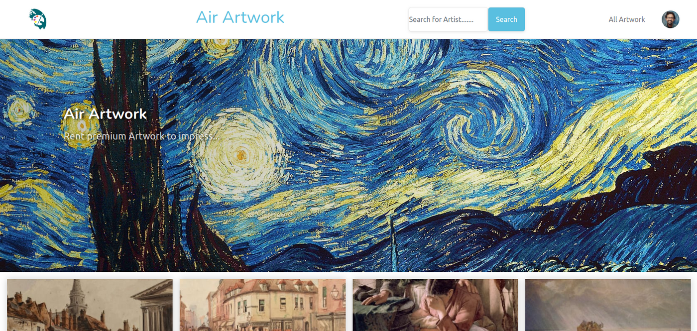

# Air Artwork

Air Artwork is a project created during a 10-week Fullstack Coding Bootcamp. The task was to realize the project within one week in a team of four students. Among other things, it served to train the teamwork before going on to the final project. In the style of Air BnB, Air Artwork allows users to rent paintings for money for a certain period of time. Anyone who is logged in can be both a renter and a lessor.

## Contributors

Sergio García:      https://github.com/Sergio-agile

Luke Bullen:        https://github.com/Luke-Bullen

Florian Cywinski:   https://github.com/Florian-Cywinski

James Carlon:       https://github.com/jcarlon23

### Rails-templates

Rails app generated with [lewagon/rails-templates](https://github.com/lewagon/rails-templates).
